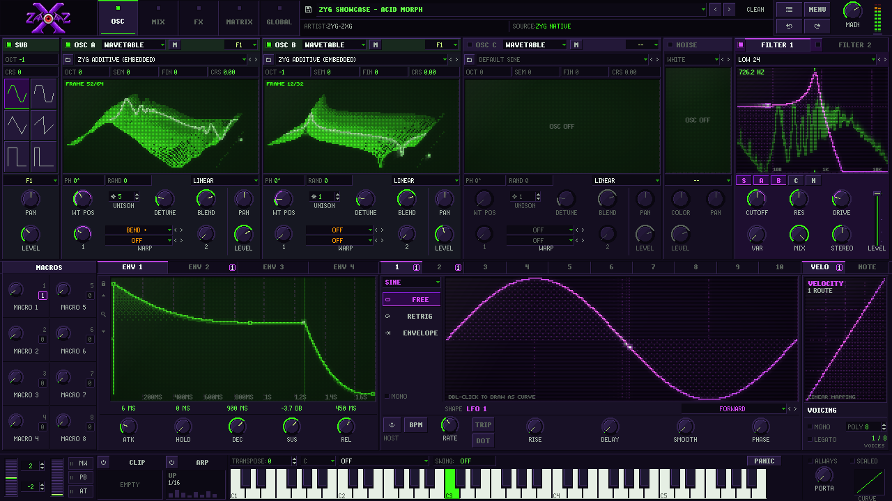
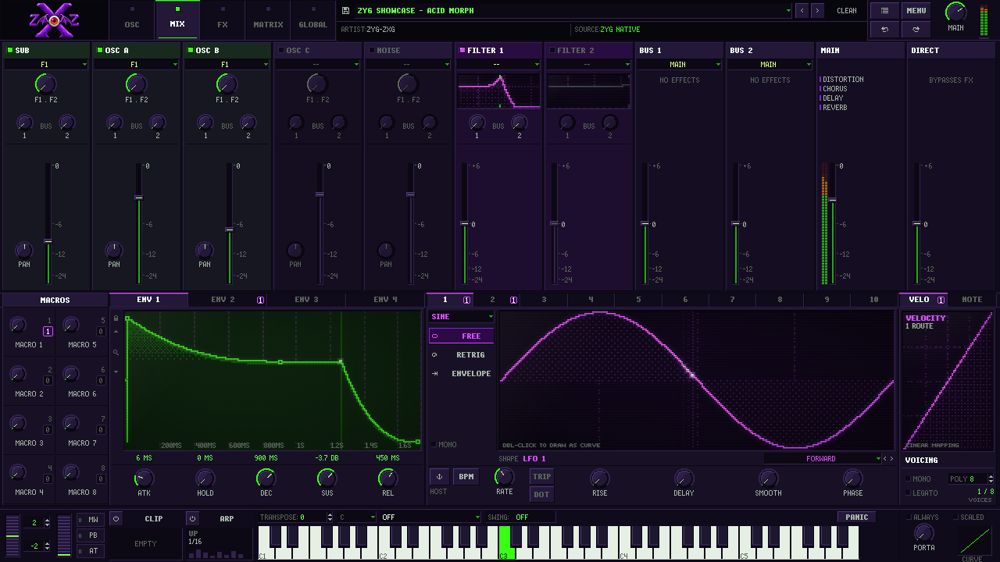
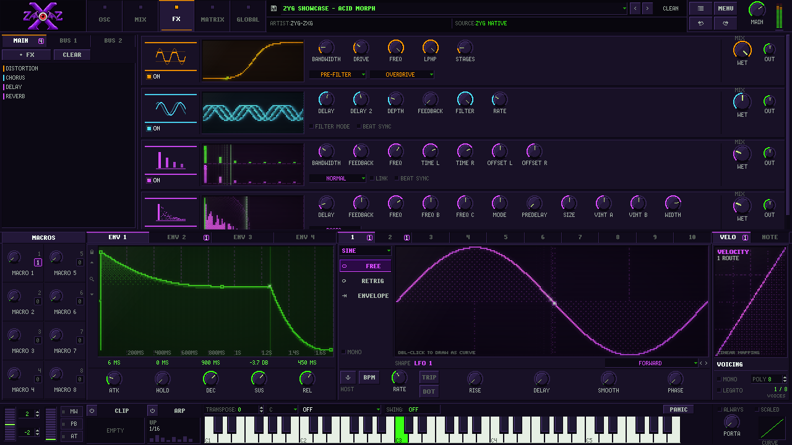
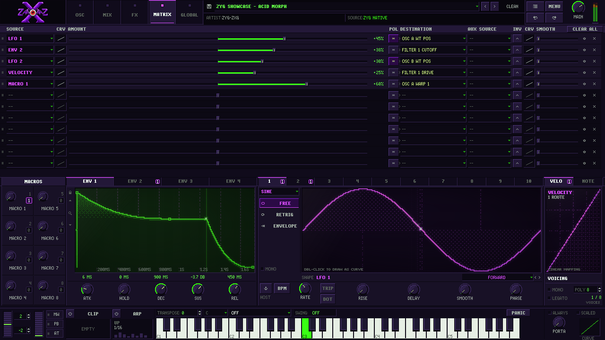
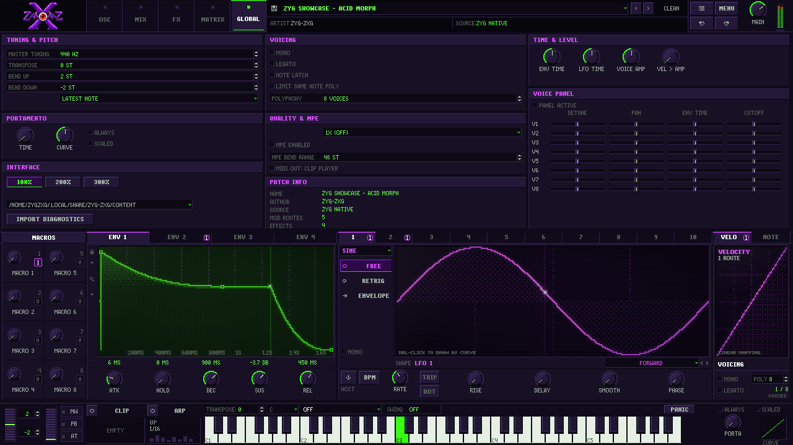

# ZYG-ZXG

**A native Linux wavetable synthesizer (VST3 + CLAP) with its own DSP, a Y2K pixel-art interface, and the ability to open Serum 2 presets.**

> **Version 0.1.0 beta — unstable.** Expect bugs and crashes; save your projects often.
> **Serum 2 presets are only partially supported.** Most of them load, but many parameters are not yet interpreted correctly, and **imported presets currently do not sound like they do in Serum 2** — often not even close. Closing that gap is the main work item for the next versions (see [Roadmap](#roadmap)).
>
> ZYG-ZXG is an independent GPL-3.0 project. It is **not affiliated with, endorsed by, or derived from Xfer Records**. It contains no Xfer code, and it ships no Xfer presets, wavetables or samples. "Serum" is a trademark of Xfer Records.



## The vision

Linux music makers don't have a modern, Serum-class wavetable synth that runs natively. ZYG-ZXG aims to be that instrument:

- **A real instrument on Linux first.** It should run natively in REAPER on Linux (the primary target) and in other hosts, as VST3 and CLAP, with no Wine and no Windows binaries.
- **Its own sound engine.** All DSP is original: wavetable/sample/granular/spectral oscillators, ~80 filter types, envelopes, LFOs, a modulation matrix, and a 13-effect rack with splitters. ZYG-ZXG is not a clone of anyone's code.
- **Your Serum 2 presets open, and should *behave* like Serum.** Serum 2 presets are an *interoperability input*. The goal is not bit-identical output. The goal is that a reese still sounds like that reese and a growl still growls: the same character, movement and levels. The importer keeps everything it doesn't understand yet, so nothing is silently thrown away. As mappings get calibrated against real Serum, the same presets will sound progressively closer.
- **Made for electronic and bass music.** ZYG-only extras include a PUMP ducker, a STUTTER beat-repeat, host sidechain as a modulation source, resampling the output into an oscillator, and MIDI CC as a modulation source.
- **An interface with character.** It uses a Serum-style layout drawn as crisp Y2K pixel art. Every display (oscilloscopes, the 3D wavetable, filter response + live spectrum analyzer, envelope, LFO) is rendered as late-1990s hardware: green LCDs and violet CRTs with pixel grids, scanlines, phosphor persistence and glow.
- **Open.** GPL-3.0, developed in the open, with honest compatibility reporting in [`compatibility/serum2_support.json`](compatibility/serum2_support.json) and the [compatibility matrix](docs/SERUM2_COMPATIBILITY_MATRIX.md).

## What works in 0.1 beta

- VST3 and CLAP instruments for Linux x86_64, tested mainly in REAPER 7 on X11. The editor opens at 1280×720, can be resized, has 1×/2×/3× pixel scaling and uses OpenGL rendering (can be switched off).
- **Oscillators:** 3 main oscillators (wavetable, sample, multisample/SFZ, granular, spectral) with unison and 2 warp slots each, plus SUB and NOISE.
- **Filters and routing:** two filters with ~80 types, per-source routing, and mix buses.
- **Modulation:** 4 envelopes, 10 LFOs (incl. chaos types and drawable paths), 8 macros, velocity/note, mod wheel, pitch bend, aftertouch, MPE, random/alternate, voice sources, audio-rate sources and MIDI CC.
  - **Drag and drop** any source handle onto a knob, field or fader, or **right-click any control → MOD SOURCE**.
  - The matrix page is the precise editor for every route.
- **FX rack:** 13 effects and 3 band splitters, with animated scopes and per-effect glyphs.
- **Arp and clips:** arpeggiator and clip player.
- **Presets:**
  - **Browser:** search, a Factory/User filter, a Serum/ZYG format filter and a type list. It stays open while you audition presets with click or ↑/↓.
  - **Navigation:** the ◀ ▶ arrows continue through the browser list.
  - **Native format:** `.zygpreset` saves the full patch, including embedded wavetables.
- **User library in `~/Documents/ZYG-ZXG`** (Presets, Wavetables, Noises, Samples, Impulses), like Serum's Documents folder. It can be moved from the menu. Serum and ZYG presets you put there are all treated as user presets.
- **Serum 2 import:**
  - It decodes `.SerumPreset` files and maps most known parameters, modulation routes, FX and assets onto the ZYG engine.
  - Anything it can't interpret is kept and listed under **NOTES** in the top bar.
  - Serum wavetables, samples and factory presets are **not included**. Point ZYG-ZXG at content you legally own (MENU → SET CONTENT FOLDER).
- An example patch built entirely from ZYG content: [`presets/ZYG Showcase - Acid Morph.zygpreset`](presets/).

## Known limitations

- **Imported Serum 2 presets sound different from Serum 2.**
  - Parameter scaling, modulation amounts, warp/filter/FX curves and envelope/LFO timing are ZYG's own guesses. None of them has been calibrated against real Serum yet ([details](docs/SERUM_ORACLE_HANDOFF.md)).
  - Some Serum features are stored but not rendered, e.g. tempo-synced envelopes and Serum 1 compatibility mode.
  - The legacy `.fxp` format is not supported.
- **Beta stability:**
  - Only REAPER on X11 has been exercised by hand. CLAP editor use, other DAWs and Wayland are largely untested.
  - Velocity/note curve editing, macro renaming, effect-chain presets and drag-reordering of FX/matrix rows are missing.

## Screenshots

| | |
|---|---|
|  |  |
|  |  |

All screenshots use the ZYG-native showcase patch.

## Install (Linux x86_64)

1. Download `ZYG-ZXG-linux-x86_64.tar.gz` from the [releases page](https://github.com/zznorthstar/linux-serum-synth/releases) and extract it.
2. Copy the whole `ZYG-ZXG.vst3` folder into `~/.vst3/` and `ZYG-ZXG.clap` into `~/.clap/`.
3. Restart or rescan your DAW, insert **ZYG-ZXG** on an instrument track, arm it and play.

More detail is in [docs/INSTALL_LINUX.md](docs/INSTALL_LINUX.md).

## Build from source

You need x86_64 Linux, CMake 3.24+, Ninja, a C++20 compiler, `libzstd`, and ALSA/X11/FreeType/OpenGL development packages. JUCE 8.0.9, nlohmann/json and clap-juce-extensions are fetched at pinned versions.

```sh
cmake -S . -B build -G Ninja -DCMAKE_BUILD_TYPE=Release
cmake --build build --parallel
ctest --test-dir build --output-on-failure
```

The outputs are `build/ZYGZXG_artefacts/Release/VST3/ZYG-ZXG.vst3` and `build/ZYGZXG_artefacts/Release/CLAP/ZYG-ZXG.clap`. With `-DZYG_BUILD_TOOLS=ON` you also get an offline preset renderer (`zygzxg_render`) and a UI snapshot tool (`zygzxg_ui_snapshot`).

## Roadmap

1. **Make Serum presets sound right.** Calibrate parameter scaling, modulation amounts and the warp/filter/FX/envelope curves against real Serum 2 through controlled test presets. This work is planned on Windows with a licensed Serum ([plan](docs/SERUM_ORACLE_HANDOFF.md)).
2. **Finish the feature set.** Matrix aux sources and curves in the UI, velocity/note curves, tempo-synced envelopes, macro naming, FX-chain presets.
3. **Broaden host testing.** Verify CLAP, Bitwig, Ardour and Wayland, and harden stability toward a 1.0 release.

## Project docs

- [HANDOFF.md](HANDOFF.md): current engineering status.
- [DESIGN.md](DESIGN.md): the UI design system.
- [docs/DSP_DECISIONS.md](docs/DSP_DECISIONS.md): DSP choices and every unverified assumption.
- [docs/TESTING.md](docs/TESTING.md): what has been verified, and how.
- [AGENTS.md](AGENTS.md): engineering rules (including how Xfer material may and may not be used).
- [CONTRIBUTING.md](CONTRIBUTING.md): how to contribute.

## License

GPL-3.0. Third-party components and their licenses are listed in [docs/THIRD_PARTY.md](docs/THIRD_PARTY.md).
